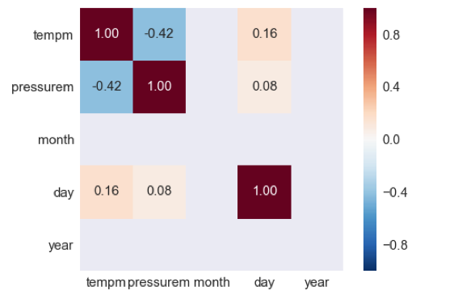
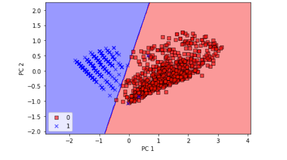

# MACHINE LEARNING ALGORITHMS ON DELHI WEATHER DATA  
## Abstract—  
Data Manipulation is the first step in machine learning. This step itself doesn’t provide any usable outputs, but it is very crucial for further analysis that we perform on the data. Data from real life is generally very noisy. It may contain null values, trivial data and false values due to error in recording equipment. We must remove noise from the data and make it clean so that it can be used for learning. In this experiment I have taken weather data of Delhi. This data will be used to predict whether the outcome is haze or fog depending on temperature and humidity values.

## I. INTRODUCTION
Machine Learning algorithms for most of the cases are designed to work for organized data and might throw an error if there are null values in data or predicts a function with significant errors. To avoid this, we import data collected from real life, observe the data and make necessary changes both general and specific to the problem and then use the new data for learning data. In the Delhi weather data set, there are a lot of parameters affecting each other and also weather outcome. To make the problem simpler we consider only weather conditions haze and fog and assume that it is mostly represented by temperature and humidity most of the time. Although it is certain that other factors have an impact on weather condition, it is clear from the data that temperature and humidity have the most effect.

## II. Methodology
We import the data from csv file and convert it to a data frame that is ready for manipulation. We plot graph of all pairs to check which parameters determine the weather. We take clue from the graphs for which weather conditions to choose for classification. For example, light rain and heavy rain may have almost similar conditions and there is no point in classifying them. Then we remove the rows with null values and we also remove outliers if possible. We then apply all the machine learning algorithms on this cleaned up dataset.

## III. Database
The database contains different attributes of environment like temperature, pressure, humidity and wind direction. All these parameters determine whether the weather is clear, windy, stormy, foggy etc. To simplify our analysis, we consider only haze and fog as they have very contrasting values in terms of temperature and humidity.

## IV . Experiments
1. Data pre-processing
Initially we plot graphs between different parameters to observe patterns between the parameters. (Figure.1)

As it is evident from the figure it is too complicated to classify those many weather conditions. So we reduce the complexity of data by selecting a few weather conditions and by elimination null values.(Figure.2)

Violin plots are used to represent variable distribution.(Figure.3)

Box plot is another way of representing distribution(Figure.4)

From violin plot or box plot we can observe that humidity and
temperature can be used to differentiate between fog and haze but other factors are not as useful.

## 2. Perceptron
a. Initially two classes Haze and fog are taken for classification. On this data the perceptron was run for 10 epochs. The training stopped when error was approximately 0.0001. The system was tested and the below figure show error vs no of epochs graph.
b. When epochs were less, i.e. 10, no of misclassifications were less (Figure.5), but it was not able to draw a good boundary(Figure.4)
c. When no of epochs were more, i.e. 100 no of misclassifications were high(Figure.3) but it was able to draw a good boundary(Figure.2) between haze and fog.

## Decision tree
Decision tree is a representation of several conditional statements that take place at each step while arriving at a solution for a classification problem.
At each step the parameter used to decide the class is chose based on entropy of the parameter.

## Logistic Regression:

The above picture represents how logistic regression was able to classify haze and fog effectively. Her 0 represents fog and 1 represents haze.

## Linear regression
First, we try to find out the correlation between all the parameters. Below figure.2 shows the correlation between different parameters of the data. As we can observe from the below figure, there is a good correlation between day and temperature. Using this we will try to fit the data using linear regression model.

From the below figure (Figure.3) we can see the mean square error decreases as the no of iterations increases. After certain no of iterations, the error reaches minimum indicating that the data has been learnt by the model

From the above diagram we can see that the linear regression model has tried and fit the line in such a way that the mean square error is minimum. We were able to fit the data using linear regression model and outcomes of new input can be predicted with reasonable accuracy.

## Clustering
In the first experiment we cluster the data into 2 different clusters. The clustering has been shown in Figure.1

The data is divided into 3 clusters represented in Figure.2

We divide the data into 4 clusters in the below figure (Figure.3)

Now, we divide our data into 5 clusters. This is represented in the figure below (Figure.4)

As we can see here the algorithm started clustering the data on the same line into different clusters. This indicates overfitting of the data and the clusters can’t generalize well for out of sample data. So we stop our clustering at 4 or even at 3 for more generalization.

## Multi-Layer Perceptron:

Multilayer perceptron has four types of activation functions frequently used. Tanh, relu, logistic and identity. The MLP is tested with different activation functions and also different no of neurons in different no of hidden layers. Experiment with 3 hidden layer with 192, 512 and 128 neurons is tried first and then single hidden layer MLP is used for the experiment.
The results are tabulated below.

| Time           | Tanh  | Relu | Logistic | Identity |
|----------------|-------|------|----------|----------|
| 3 hidden layer | 101.4 | 98.4 | 94.9     | 89.9     |
| 1 hidden layer | 22.6  | 21.0 | 8.0      | 2.7      |

| Accuracy       | Tanh  | Relu  | Logistic | Identity |
|----------------|-------|-------|----------|----------|
| 3 hidden layer | 0.997 | 0.997 | 0.995    | 0.994    |
| 1 hidden layer | 0.996 | 0.997 | 0.995    | 0.994    |

| No of iterations | Tanh | Relu | Logistic | Identity |
|------------------|------|------|----------|----------|
| 3 hidden layer   | 23   | 23   | 23       | 23       |
| 1 hidden layer   | 70   | 70   | 25       | 14       |

## Support Vector machine:

The parameters are temperature and humidity which play a key role in deciding the output.
Input data temperature and humidity are fed into input neurons of SVM and trained on dataset to predict the output. SVM uses backpropagation algorithm to adjust its weights so that it can predict the weather outcome.
The output looks as shown in the figure below

In the algorithms used above, the linear kernel takes less time but sometimes better accuracy can be obtained by non-linear filters.

When the feature space is very large, it is better to use linear kernel, because non-linear kernels do not give any significant performance prediction

## Principal component analysis
The data set selected for this experiment is Delhi weather data. For simplifying the analysis the data set was pre-processed to have only two weather conditions haze and fog.
Initially logistic regression was used and data was separated into haze and fog based on temperature and humidity values using a hyperplane of 2 dimensions.
First the data is plotted using scatter and the following figure is observed.

The below figure shows how the data set was separated by logistic regression.

The same was performed on test data.

As we can see from the above two plots, the hyperplane was able to classify the data properly.
But if the data was more complex for logistic regression to analyze, principal component analysis would be useful.
Applying principal component analysis on the data and plotting the scatter plot, we get the following figure.

Classification of train data using PC 1 and PC 2

Classification of test data points using PC 1 and PC 2

## V . Conclusion
The data that we have chosen linearly separable, so a linear perceptron will suffice. Linear regression is not suitable for this type of data as the points are very wide spread. The data set was simplified and multi-layer perceptron was applied. The time taken and accuracy for each activation function were calculated and identity and logistic functions were found to give results faster with a similar accuracy as that of other activation function for this data set. SVM with linear kernel was able to classify the data with acceptable accuracy, but with kernel of polynomial degree 3 it was able to fit the train data better. It is highly probable that degree 3 kernel will have less test data accuracy than the linear kernel. PCA was found to provide no significant improvement to performance or accuracy for this dataset.

## VI. References
[1] https://www.kaggle.com/mahirkukreja/delhi-weather-data

